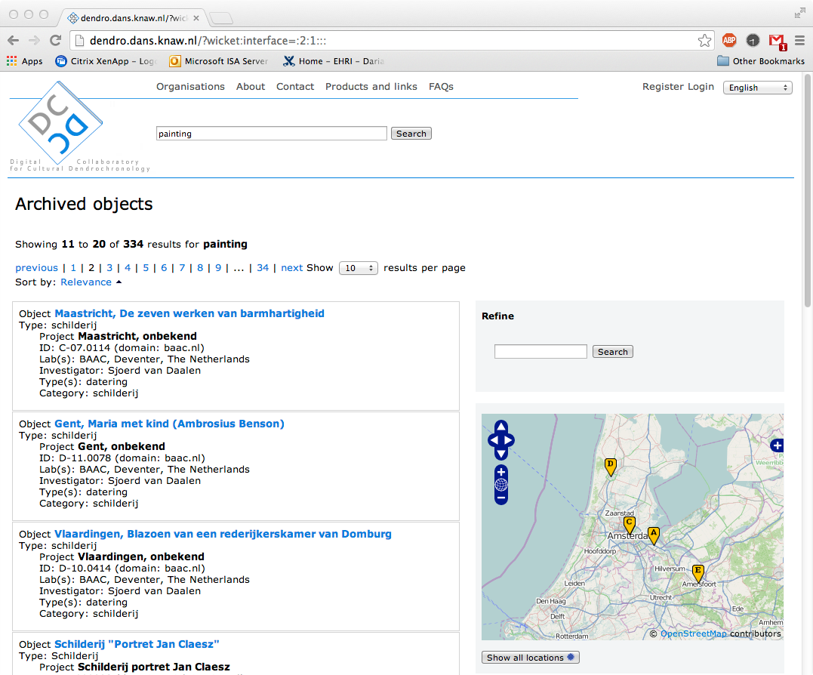
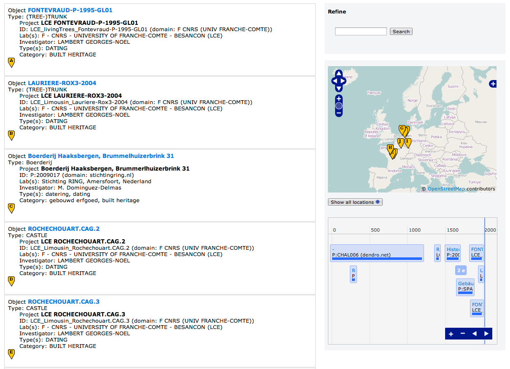
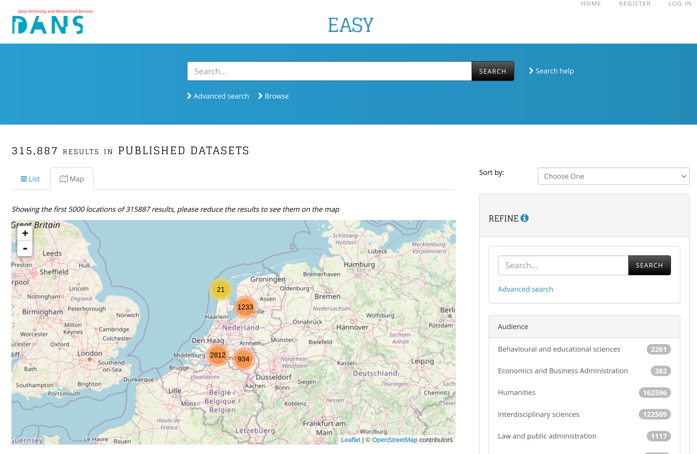
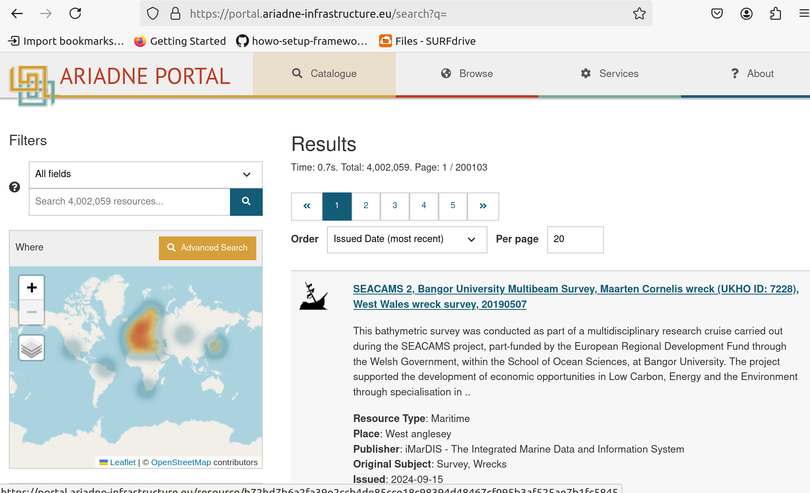
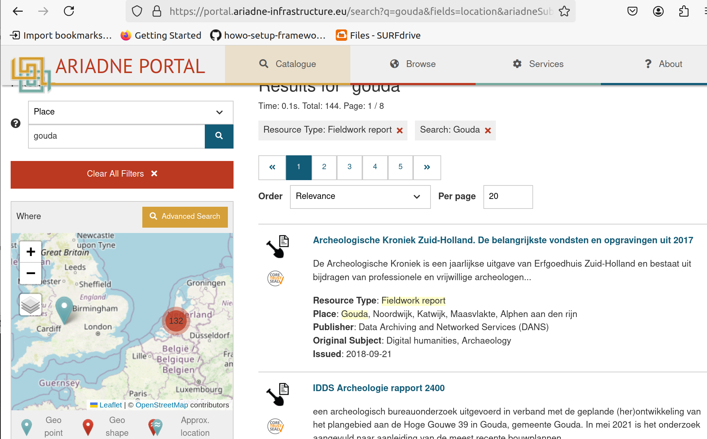
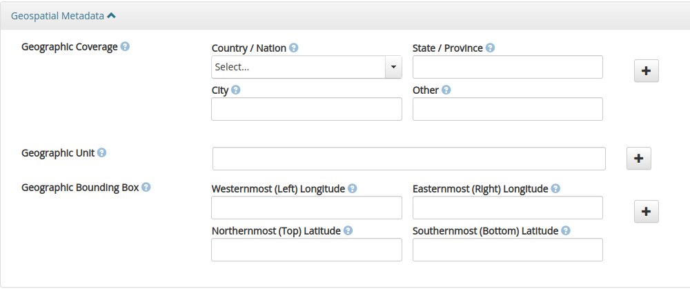
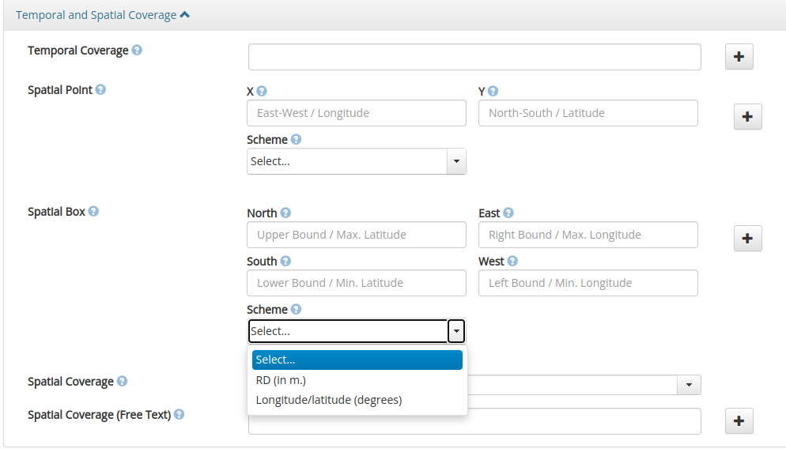

Adding a geospatial map of dataset search result to Dataverse
=============================================================
*A 'landscape' analysis*
========================

Version 0.4 - Concept/Draft, January 2025. 

Introduction
------------

This document will give a brief description of the Dataverse software architecture and how DANS can extend the functionality of Dataverse to provide geographical capabilities, like showing locations on an interactive map and possibly search using the location information. 
Effort is being done to prevent to much technical detail, but it is inevitable that some technical knowledge is needed to be able to understand the software terms and concepts mentioned here. 

Existing geospatial functionality in Dataverse
----------------------------------------------

Dataverse can do some things with geospatial information:  

- Preview of files (geojson for example) in a dataset. 
- The search API allows for searching using geospatial parameters (see [this guide][guides-geospatial-search]). However this seems to be confined to the indexing of the custom `Geospatial Metadata` block in Solr, which is 'hardcoded' and assumes WGS84 coordinates. 
  
  **TODO:** Get Confirmation!

  Note that it is not displayed on a map in Dataverse. 
  Also note that the DANS Archaeology DataStation is not using that custom block, but one of our own instead (see Appendix). 

The Dataverse architecture in a nutshell
----------------------------------------

### The current architecture

Dataverse as a single web application (sometimes referred to as a monolith), although internally it is 'modular'. Note that it uses other services, like Postgres and Solr and DANS also has it's own 'micro' services connected to it. 
Important aspects of the current Dataverse system: 

- It is built with Java Server Pages (JSP and in case of Dataverse it is Primefaces) we have the page (GUI) in XHTML templates and Java classes (EJB) at the backend, all compiled into a singe web application. 
- It does have an extensive API on that backend, which is being extend even further because of the transition to the new SPA architecture (see next section). 
- The metadata (containing the location information like names and coordinates) is stored in a Postgres database. For searching the Solr indexing service is being used. The indexing via Solr is configured with a schema XML file. 

### The new architecture

In te new architecture the Dataverse frontend is a Single Page Application (SPA). The main change is the separation of frontend (GUI) and backend. The idea is that it would make it easier for us (and others) to create our own frontend on top of the 'standard' backend via its API. 
The code repository can be found [on Github][dataverse-frontend-code] and there is also a [demo site][dataverse-frontend-demo]. 

Important aspects: 

- The backend is kept, but the API will extended to support the new frontend. 
- The frontend is done with the React framework. 

Information about the roadmap can be found [here][dataverse-frontend-roadmap]. 
It seems to be stuck at 'Q2 2024' and also the [sprint][ataverse-frontend-sprint] does not show much activity. 

It is uncertain when it will be in a state that DANS is able to have it replace the 'old' frontend. 

Different ways to extend the functionality
------------------------------------------

### The current architecture

- Change the code (also GUI) via an Issue and accompanying Pull request on IQSS's Github repository. 

- Custom homepage, header and footers and CSS can be configured
  HTML (optional with JavaScript) fragments can be specified and the Dataverse application will 'inject' those into its web pages. 
  We have used this, also to 'inject' some other code like the Freshdesk 'widget' shown at the bottom of the DataverseNL site. 
  Analytic code (SJ) can be 'injected' as well, we use this with the Matomo statistics service. 

- External tools and previewers
  For files, not for search results!

- Controlled vocabularies (Cvocs), configure external service to retrieve metadata terms (via Skosmos for example) that is used in autocomplete and for using URI's in the metadata and still show the readable 'labels' in the GUI. 
'. This is now also done with JavaScript. 

- External service can be hooked to specific archival 'events' like publication of a dataset. 
  These services are passed information about the dataset in question and can change the dataset metadata. 

- Plugins
  Plugins could be developed in their own software project and do not have to be 'compiled ' into the application code. 
  Extending the backend, but could in principal also be used to extend the frontend if it is JSP. 
  In several location in the code there are SPI's (interface specifications for a plugin), but only for the export metadata functionality Dataverse is 'scanning' and loading jar files at run-time startup. 

### The new architecture

The new architecture has the front end as a Single Page Application (SPA). It keeps the backend, which is now allowing the configuration of the extendabilities mentioned before. It therefore seems likely that those features will be supported. 

There are a lot of uncertainties:  

- Could be that there will be support for pluggable components in the front end, but I did not see any indication this will be done. With React there is something ... but it is not used yet. 

- There are also ideas about support for search plugins ([see this issue][external-search-issue]). 
This would allow Dataverse to use a plugin to get search results from, instead of the built-in Solr search it is doing now. 

Different ways we could add the geospatial functionality
--------------------------------------------------------

Some non-functional requirements will play a role in choosing one of the options. 

- we have a limited time frame to realize at least the minimal requirements. Not sure it is clear what they are, but the absolute bottom line would be to show these dataset locations on an interactive map similar (but not necessarily identical) to what we had in EASY. 

- we want  this to be maintainable and thus to make it a community effort as much as possible avoiding that DANS has to maintain its 'forked' Github code repository for a long time. The functionality should be relatively simple to adapt or configure to make it useful for others, that is; with other coordinate systems and or from other custom metadata blocks. For DANS this would be for instance supporting the DCCD metadata in DataverseNL. For the community that should at least be that custom `Geospatial Metadata` block supplied by IQSS. 

The change of the Dataverse architecture and our wish to change frontend code is a complicating coincidence, so we should try minimize the differences of what we will add and what will be needed in that new SPA. 

### Change of frontend

- Using JavaScript 'injection'; via the custom footer for example. 
  This cannot be done with React code, we could use JavaScript with the jQuery library already in Dataverse frontend. This is a quick way of testing some basics without changing any of the Dataverse code.

- Using a mechanism similar to the previewer/external tools. However some code changes in Dataverse are needed because now tools/previewers are on files and not on search results. The 'map' should be optional and in an 'iframe' in the GUI where we can configure that content from another source (could be on same server) will be shown. 
 This could be React code, so we have better reusability when migrating to the new SPA system. 

 - Change the JSP code 
   Use a Primefaces (leaflet) map tool and 'connect ' this to the search results handing in the Java code (see [Primefaces map][primefaces-osmap]). Some Dataverse configuration is needed, because we want it to be optional and we need to specify how the coordinates must be extracted from the metadata. 
It looks like this is difficult to do without more changes on the backend code. 

The options above are limited to display locations. The JavaScript  code contains the logic that extract the coordinates from the metadata and convert them into coordinates that can easily be displayed on the map (WGS84). 
The Dataverse application (backend) is not aware of the geographical nature of the metadata fields. If we want to be able to do 'Geo searches', like limiting results to a bounding box, or sorting with the distance to a location for example, we would need to index them as coordinates.
 
Solr can do this. (?) Somewhere it is done for that custom block DANS does not use... 
Converting all coordinates to one common standard GPS (WGS84) which allows for comparing. The original coordinates must be stored, but for indexing these 'standard' coordinates should be indexed. 

This will also allow us to search for dataset that have coordinates in the first place, instead of filtering all search results on the frontend. 
At DANS this might not be a big problem, in our Archaeology archive almost all datasets have coordinates. But for others (and we want to have the community with us). datasets with coordinates might be sparse. 

### Options for change on backend

 - Add a new 'coordinate'  field types for latitude longitude and the 'coordinate system' (EPSG code). 
   Specification is done via the TSV files. 
   Dataverse should use a library to convert these coordinates to WGS84 and index them in Solr. 
   The Dataverse search interface must be adapted somehow allow to specify bounding boxes, 
   sorting etc. via the GUI. 

 - Use a plugin approach to extend the indexing of a custom metadata block, which then would do the coordinate extraction and transformation in Java code. 
   This has major consequences for the search logic which I can not oversee. 
   But this might be something that will replace those TSV (Tab Separated Values) files based customization, because it is cumbersome. Using plugins would possibly also allow for custom metadata with special UI behavior and or validation, which is now much limited. 

References
----------

- [https://github.com/IQSS/dataverse-frontend][dataverse-frontend-code]

[dataverse-frontend-code]: <https://github.com/IQSS/dataverse-frontend> "Github repo for the Datverse frontend SPA code"

- [https://beta.dataverse.org/spa/collections][dataverse-frontend-demo]

[dataverse-frontend-demo]: <https://beta.dataverse.org/spa/collections> " "

- [https://www.primefaces.org/showcase-ext/sections/osmap/markerUsage.jsf][primefaces-osmap]

[dataverse-frontend-roadmap]: <https://github.com/IQSS/dataverse-frontend?tab=readme-ov-file#roadmap>

- [https://github.com/IQSS/dataverse-frontend?tab=readme-ov-file#roadmap][dataverse-frontend-roadmap]

[dataverse-frontend-sprint]: <https://github.com/orgs/IQSS/projects/34/views/36>

- [https://github.com/orgs/IQSS/projects/34/views/36][dataverse-frontend-sprint]

[primefaces-osmap]: <https://www.primefaces.org/showcase-ext/sections/osmap/markerUsage.jsf> "Primefaces map"

- [https://guides.dataverse.org/en/6.2/user/find-use-data.html#geospatial-search][guides-geospatial-search]

[guides-geospatial-search]: <https://guides.dataverse.org/en/6.2/user/find-use-data.html#geospatial-search> "Dataverse Guides - Geospatial Search"

- [https://github.com/IQSS/dataverse-pm/issues/279][external-search-issue]

[external-search-issue]: <https://github.com/IQSS/dataverse-pm/issues/279> "Project: Design and Implement External Search"

- [ https://guides.dataverse.org/en/latest/installation/config.html#parts-of-a-dataverse-installation-webpage][guides-customisation-ui]

[guides-customisation-ui]: < https://guides.dataverse.org/en/latest/installation/config.html#parts-of-a-dataverse-installation-webpage> "Dataverse Guides - Customization of the UI"

**TODO:** add more links here

Appendix
--------

Screendumps from archival sites with a geographical map. Two of them are actually DANS frontends, one of them (Ariadne) is a portal that we cooperated with in the past. 

### DCCD dendro archive (offline)

Screendumps from 2014! 

Things to notice:
- initially map is shown aside
- map shows only point corresponding with the listed search results. Only when pushing a button we get a window with the full map. 
- Correspondence between map and list results is made via labels (markers) with numbers and or letters. 
- Also aside is a view of the time periods.

### EASY archive (nearly offline)

Changed into a 'tabbed' view, with the list 'tab' being the default one and to the left the geolocation 'tab' button. With this selected the list view is replaced by a geographical map view showing up to 5000 locations on the map. This could take some time when on the initial 'home' page we get 150k+ datasets. The map would only show the top 5000 results. Restricting the results by filtering made the map show all results (when less then 5000). 

Things to notice:
- initially map is not shown, you need to select the map 'tab'. Note the the selection this is part of the 'session' and state is kept on the backend. 
- The RD coordinates had to be converted to WGS4 at the client side and no display of the bounding boxes or the other coordinate option for the metadata fields (Lon Lat?). 

### Ariadne portal

The site is here: https://portal.ariadne-infrastructure.eu/

Things to notice:
- map shown at the side initially
- Heatmap shown when there are lots of points
- Polygons are indicated with different (balloon) markers.

### Dataverse custom metadatablocks or input forms

Screendumps from the 'old' Dataverse frontend showing input forms for geographical metadata. 

