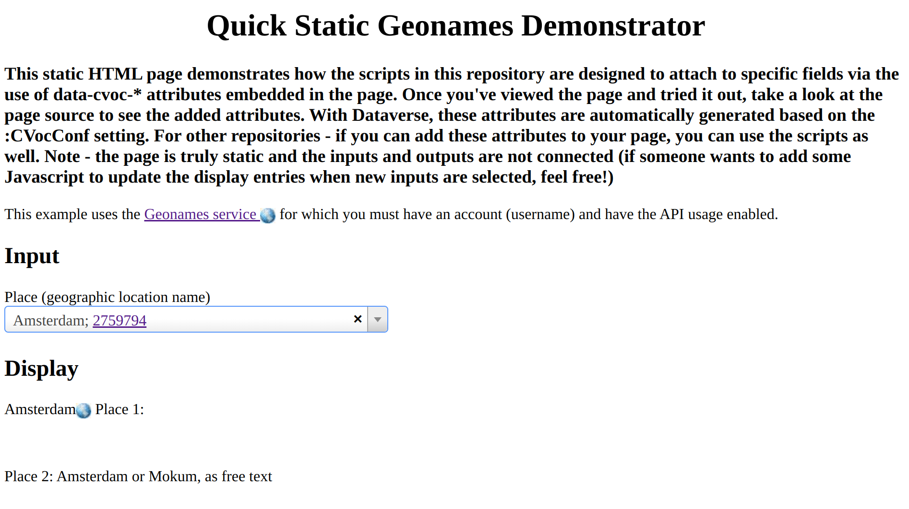

Geographical CVOC Extension
===========================

Extend with improved 'CVOC' funcionalities for the dataset metadata input of a location by the placename as text. 
Instead of just free text we use Geonames service to retrieve the name and it's ID. 

__NOTE__: The geonames services can do a lot more than lookup names and also has coordinates of places. 

__NOTE__: The GeoNames API limits users to a maximum of 10000 credits per day and 1000 credits per hour. See here for a list of how many credits a request to each endpoint uses.

The 'static' example is  based on the code for Orcid in the gdcc Github repository for CVOC support: https://github.com/gdcc/dataverse-external-vocab-support/blob/main/examples/staticOrcidAndRorExample.html

The example will only work if the geonames username (of an API enabled account) is inserted in the code. 

The [stand alone (static) geonames as CVOC example html file](./staticgeonamesExample.html).

It's main purpose is to develop the client code (Javascript) without the need of a Dataverse application and its configuration. 

The ‘Input’ and ‘Display’ sections mimic the way that Dataverse will render the HTML when configured for this geonames CVOC connection. The ‘Input’ section allows to enter a name of a location and there will be autocomplete functionality resulting in a Geonames ID, instead of free text.

The ‘Display’ section has element that contain the Geonames ID and the script will insert an icon with a link to the Geonames landingpage of that location. 

The next screenshot was taken after 'Ams' was entered and then the correct value (Amsterdam) was selected from the autocomplete dropdown. 

The jQuery Select2 component is used to implement the autocomplete dropdown. 
The following geonames endpoints (or pages) are being used: 

- A landing page for a place using the geonames id or the URI: 
  `https://sws.geonames.org/{id}`
- An API endpoint to retrieve JSON with the name given the 'id': 
  `http://api.geonames.org/getJSON?formatted=true&geonameId={id}&username={username}&style=full`
- An API endpoint to retrieve JSON for the matching places using the first characters:
  `http://api.geonames.org/searchJSON?q=*&name_startsWith={chars}&maxRows=710&username={username}`

The script is now producing similar behavior as for the other autocomplete input fields (via Skosmos), which is good because the user will understand the UI better if it is consistent. THe script code could also do other things, like filling in other fields or display other means of input besides that select2 jQuery component. 

The geonames service has some downsides: 

- The free API use is restricted to 1000 requests per hour, this might not be enough if the archive is used a lot with simultaneous dataset creation or metadata editing. We could pay for it and get more allowed requests if this is happening. 

- The API needs a username (like an API key). 
If we put that in the client code anyone could use that for their own purpose. We could create our own service that uses the geonames in turn on the server side. That 'proxy' service should restrict access to the browser and have CORS set to only allow XHR from our own pages. 